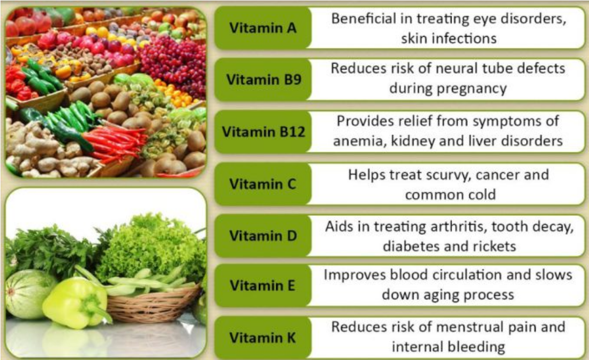

# Food Nutrients: An Unsupervised Learning 

## Overview

-- **What is the problem?**
We focus on a large number of food items (8618 items) and their different food nutrients (23 nutrients). Our goal in this project is twofold. First, we desire to only focus on a smaller subset of the food nutrients. Not all of the food ingredients are equally important. Using PCA, we would like to find a subset of the 23 nutrients which is responsible for the major part of the variation in the food nutrients. Second, after reducing the number of features (*i.e.* food nutrients), we would like to classify the 8618 food items into a number of clusters, using k-means clustering algorithm.  

-- **Metrics of Success**
In this project, we aim to achieve the following goals:

   1. *Reducing the number of food ingredients*: Using PCA, we reduce the number of features (food nutrients in this context) to a smaller subset so that the a large portion of variance is still captured.
   2. *Understanding the properties of the new features*: Each new feature will be a linear combination of the old features. We would like to obtain a qualitative understanding of the new features. For instance, we would like to understand that what old features vary most for each new feature.    
   3. *Clustering the food items*: After reducing the number of features (through the PCA algorithm), we intend to classify the food items into a number of clusters, using the k-means algorithm approach.
   4. *Understanding the properties of the clusters*: We would like to obtain a good understanding of the clusters. Among many factors, we intend to determine the size of each cluster, the food items in each cluster, and whether or not some clusters will be more significant than others.
   
**-- Why is this project important?**
Most people know good nutrition and physical activity can help maintain a healthy weight. But the benefits of good nutrition go beyond just weight. Having a good understanding of the nutrition factors and applying this knowledge in decision making when it comes to foods can have an immense impact in one's physical and mental health. However, the problem is that there are too many food items and too many food nutrients! Also, not all nutrients are on equal footing! Therefore, picking the most relevant factors and classifying the food items according to picked nutrients is of vital importance.

## Conclusions
We list the key findings of the analysis performed in this project:

 1. Starting from 23 food nutrients for 8618 food items, we were able to reduce the number of variables to 10 new features, using the PCA algorithm. In this reduction, we were able to maintain 80% of the total variance.
 
 2. The properties of the 10 new features -- each of which is a linear combination of the old 23 food nutrients -- were studied in detail. We found to what nutrients each new feature is most sensitive to, and we also found the food category distribution of the 200 richest food items in terms of each of the new feature. 
 
 3. Using the Elbow Method, we figured out the optimal number of k-means clusters for the 8618 food items. We saw that among the different choices of metric, the usual Euclidean metric provides the most reliable answer to the number of optimal clusters.
 
 4. Finally, we studied the important properties of the k-means clusters. We found the size of each cluster, and we observed that there were a few large clusters as well as some very small insignificant clusters.
 
## Possible Future Directions
It would be interesting to consider the following directions for further future studies:

  1. The PCA analysis we used in this project defines new features as a *linear combination* of the old features. It would be interesting to see if a nonlinear analysis (*e.g.* through Kernel PCA or other means) would provide a way to capture the same (or even a higher) level of variance with less number of new features.
  
  2. It would be interesting to enhance our input dataset by considering different diet habits exercised by different groups of people in order to make predictions about different health characteristics (*e.g.* weight, different diseases such as heart disease and etc.) of the population of the considered group. Clearly, the current dataset is insufficient for that purpose, and this goal can thought as a part of a much wider project with perhaps different scopes.
  
## Software and Packages
We will use the following python libraries:

   - For data wrangling, we use the standard *pandas* and *numpy* libraries.
   - For data visualization and plotting, we use the standard *matplotlib* and *seaborn* libraries.
   - For implementing data standardization, PCA and KMeans clustering, we use several components of *scikit learn* library.
   - For the implementation of the Elbow Method (in order to figure out the optimal number of k-means clusters), we use the *yellowbrick* library.

